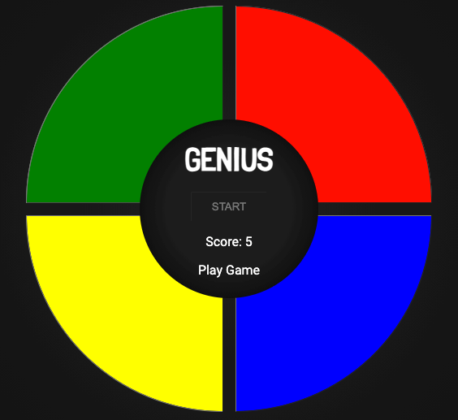

# Genius Game

## DESCRIÇÃO

"Nesse projeto, o desafio será criar um jogo Gênesis utilizando apenas HTML, CSS e Javascript de forma introdutória, sendo o principal conceito, CSS Grid, manipulação de Array e Arrow Functions."

Projeto proposto pela Digital Innovation One, no curso "Criando seu jogo de memória estilo Genius", ministrado por Gabriela Pinheiro.

## 🚀 Ferramentas

- HTML
- CSS
- Javascript
